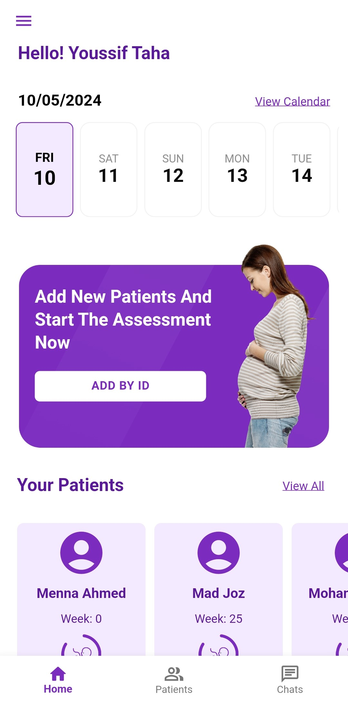
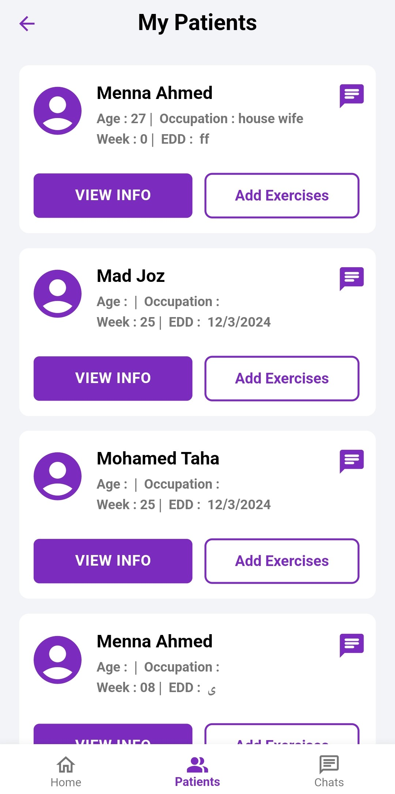
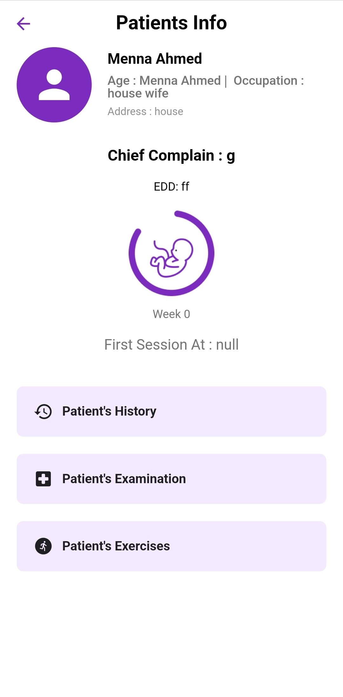
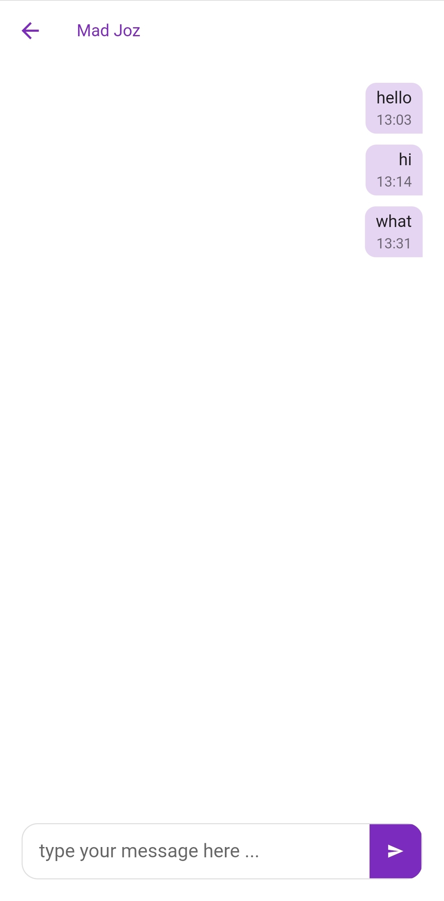
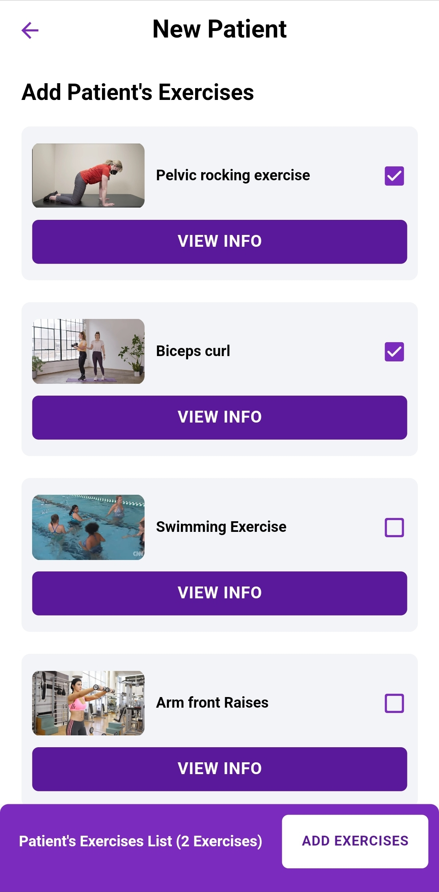

# Antenatal care

## Description
Antenatal Care app is an app made for every mom to take care of herself and her baby by following up with her physiotherapist.

## Purpose
Many pregnant women don't know how to take care of themselves and their babies, so this app is made with love towards our moms to make them in the safe area untill the labour.  

## Features
- Doctor View : The doctor's view offers a streamlined experience for managing appointments and patient records. Doctors can view appointments, add new patients via their ID, and access a list of existing patients. With a bottom bar for easy navigation, they can switch between screens for patient lists and chats, ensuring efficient communication and organization within the app.

- Patients List : This screen provides physiotherapists with a centralized hub to access patient information, prescribe exercises, and initiate direct communication. Physiotherapists can easily view patient details, prescribe tailored exercises for their rehabilitation, and initiate chat sessions for personalized support. This streamlined interface enhances patient care by facilitating efficient communication and exercise management within the app.

- Patient's info screen : The Patient's Info screen displays basic patient details for physiotherapists. It includes three sections: Patient's History, Examination, and Exercises. These sections provide insights into the patient's medical background, examination findings, 
and prescribed exercises, aiding therapists in delivering personalized and effective care.

- Patient View : The Patient View Screen offers a comprehensive view of the patient's healthcare journey. It includes a calendar for appointments, add their routines so the app will send them a reminder to do them correctly, their basic information and 4 sections chat with their doctor, the patient's history , the patient's examination and the patient's exercises.

- Chat : The Chat Screen provides a direct and convenient platform for patients and doctors to communicate effectively. Patients can easily discuss concerns, receive guidance, or ask questions about their treatment plan. This interactive feature fosters a supportive environment, ensuring seamless communication and enhancing the overall patient experience. 

- Add Exersices : The Exercise Screen enables physiotherapists to create and send customized exercise routines directly to patients. With an intuitive interface, therapists can efficiently add exercises tailored to each patient's needs, ensuring precise rehabilitation plans. This feature empowers therapists to remotely manage and monitor patients' progress, facilitating effective treatment delivery and optimizing rehabilitation outcomes.

## Screenshots
### On Boarding Screen

### Doctor View

### Patients List Screen

### Patient's info screen

### Chat

### Add Exersices

## Installation
- The Next is a link for apk file if you wish to run the app.

https://drive.google.com/file/d/1L0pLe2YN0LxaWfRH9xzmCcKTlK00rtrm/view?usp=sharing

